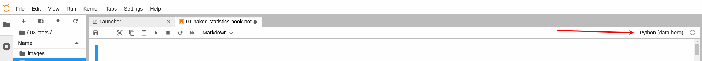

# Intsights' Data Hero Course


## Setup Instructions


#### Step 1 - Setup conda environment

```sh
conda create --name data-hero python=3.8
conda activate data-hero

pip3 install --upgrade pip
pip3 install notebook --upgrade
pip3 install jupyterlab --upgrade

pip3 install -r requirements.txt
```


#### Step 2 - Setup the IPython kernel
```sh
python -m ipykernel install --user --name data-hero --display-name "Python (data-hero)"
```


#### Step 3 - Download the sample files
- Note everything under `data/` is intentionally git-ignored.

```sh
mkdir -p data/raw
```

Download the files from [GCP](https://console.cloud.google.com/storage/browser/intsights-tc-analytics-platform/data-hero-course/data/raw?project=intsights&pageState=(%22StorageObjectListTable%22:(%22f%22:%22%255B%255D%22))&prefix=&forceOnObjectsSortingFiltering=false) (stored in the `intsights-tc-analytics-platform/data-hero-course/data/raw` directory). Place the files in the `data/raw` directory just created.


## Using the notebooks:

```sh
cd notebooks
jupyter lab &
```   
Make sure to select the `data-hero`: 



**Note:** avoid using any Jupyter extensions - they tend to cause issues ...
