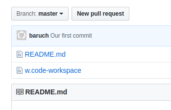

# B"H

## Baruch Arky thinks this is pretty neat

### Here's a smaller header 

#### This is the smallest one

This is the normal text. Just normal as heck. Here's a list:
- Baruch
   - car
   - truck
       - dump
- Mendy
- Yossi

---

Numbered list!:
1. house
2. car
3. mouse

---

This following word is in ***bold and italic***

---

Hi here's a cool `SQL` script:

```sql

select *
from fake-tbl
where col = 1
order by col_2

```

Here's an image



---

[My Github Repository](https://github.com/barucharky/coding_deep_dive)
[Cheat sheet](https://github.com/adam-p/markdown-here/wiki/Markdown-Cheatsheet)