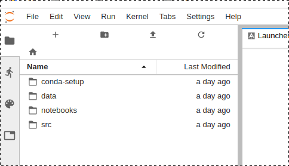
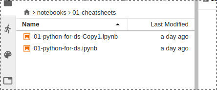
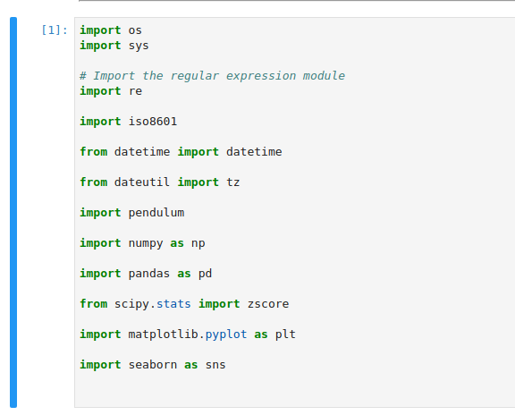
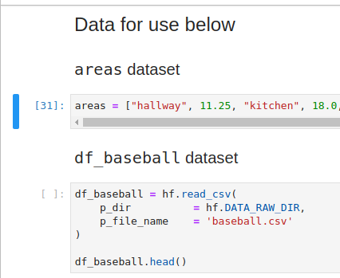

# B''H

### Intro to python

In our introduction to python we learned to use jupyter lab to experiment. This file contains notes on how to use our learning tools and some **important notes** to help us through

---

### Getting Started

Open a terminal `cd` into your `env-python-learn` folder 

For example, mine is located in `~/repos/coding_deep_dive/env-python-learn` 

##### Now type the following:

```bash
conda activate env-py-learn
jupyter lab .
```

---

##### You'll see this on the left side of jupyter lab:


---

##### Open  `notebooks` then `01-cheatsheets`. You'll see something like this:



You might only have `01-python-for-ds-ipynb`. That's fine. I made a copy so that no matter how many changes (read messes) I make, I can always go back to the original that Sruli made. This is important, because we want to treat this as a playground or sandbox. It's a place where we can try anything and we are not afraid to break things.

---

### Prepare the notebook

Rember, this notebooks is a mix of markdown and code. Any code you want to see work, you need to run.

##### This is the first thing you'll see:



##### The code in this box needs to run for the subsequent activities to work. 

To run it, move the blue bar next to this box with the `down` key and press `Ctrl-Enter`

Run the next one and the one after that, then these:



You can also run any other data sets that interest you here.

---

### Time to play!

Now you've imported all the helpful programs and preped the data sets. You can play with whatever you want.

The first time, you may want to scroll down to the "lists" section because that's important to review.

---

### Super important note about lists!

*Gevald!* This is so important. Normal variables hold the values you put in them, but list variables hold addresses. What does that mean?

##### Variables are buckets that hold values

Inside that bucket is a number or a string. If you copy one variable to another, it makes a different bucket that has the same number or string. Now you can change the new one without changing the old one.

##### List variables hold addresses

A list variable is a bucket, too. `print()` it, and it will show you the list you assigned it, but the list is not the value that it is holding. The value it stores is an **address in the computer's memory where the list is located.**

### To illustrate the point, consider the following

```python
a = 2

# print(a) will return the value of 2

b = a

# print(b) will also return the value of 2

b = 5

# now, print(b) will return the value of 5, but print(a) will still return 2
```

### Let's contrast that with a list

```python
a = [1, 2, 3]

# print(a) will return [1, 2, 3]

b = a

# print(b) will return [1, 2, 3]

# here comes the chidush

b.append(4)

# print(b) will now return [1, 2, 3, 4]
# what will print(a) return? Also [1, 2, 3, 4]!
```

### Why does this happen??

When you typed `b = a`, the computer looked inside the bucket labeled `a` and saw an **address** in memory. It then copied that **address** into `b`. 

##### It copied the address, but it didn't copy the list

Who lives at that address? The list, of course. So when you wrote `b.append(4)`, the computer thought, "oh, I'm supposed to append a list? What list? The list that lives at the address in the variable, `b`. I will go to that address and append that list"

Now when you `print(a)`, it goes back to that address and finds the list that you appended and it prints that list. 

##### It copied the address, but it didn't copy the list

If you want to make two copies of a list that can be edited independently, then instead of `b = a`, do one of these:
* `b = list(a)`
* `b = a[:]`