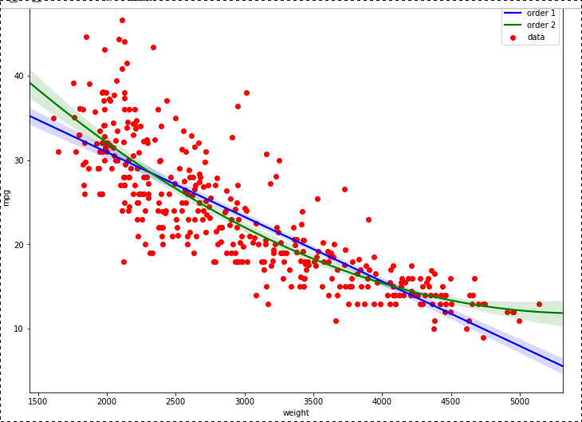

# B''H

Notes on the first glance at the notebooks on plots.

---

## `joint-and-pair-plots.ipynb`

### Libraries used

The first thing it does is import libraries. The ones that are necessary for plotting data are:
- `pandas` 
   - used to read csv files and produce dataframes that python can handle
- `seaborn` 
   - renders graphs and charts
- `matplotlib.pyplot` 
   - similar to `seaborn`, unclear in the scope of this notebook what it adds

### Joint plots

**Continuous random variables** are introduced. The are variables that can vary on an infinite scale, like time or size, but not quantity.

The different *kinds* are introduced. The default is 'scatter', 'reg' adds a regression line, 'kde' and 'hex' are two ways to display joint distribution.

### Pair plots

This is useful when you want to compare more than two variable. It will produce multiple charts according to specifications to compare each variable to each variable. You can add multiple regression lines to represent different variables that are not continuous.

---

## `line-plots.ipynb`

Now we begin to explore what `matplotlib.pyplot` has to offer. Line plots are made with precise parameters including:

- `subplot()`
   - Makes more than one chart together. Different from pair plots because the attributes of each suplot are specified
- `xlim()` and `ylim()`
   - Puts limits on the range of each axis
- `legend()`
   - Adds a little legend anywhere you want on the plot
- `annotate()`
  - Places text and arrows pointing to certain points or intersections on the plot
- `style.use()`
   - Specifies a visual style
   - In this section, four plots are produced, each with different colored lines and one with an annotation

---

## `regression-plots.ipynb`

We learn how to make a chart with a regression line. The regression line a straight line that can run through the center of the data. It serves as a kind of prediction of the relationshipt betwen **X** and **Y**.

After that, we can make 'residual' plot which basically shows how far the data is from the regression line. 

##### The formula is like this:

Residual = Observed value - Predicted value
e = y - ŷ

##### It looks like this:

### You can group several regression lines together by hue

Each representing a different grouped value. This data set is about cars, so 'country of origin' is the example used.

You can also give each group their own subplot. All you have to do is tell it which row or column to group by.