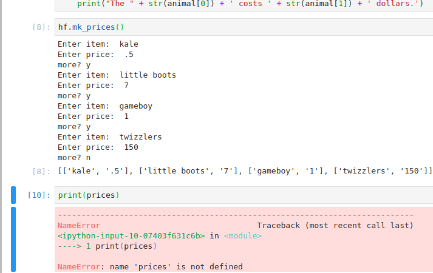

# B''H

## Questions for Sruli

---

### Why is this happening?



##### Here's the code

```python
def mk_prices():
    prices = []

    while True:
        item = input('Enter item: ')
        price = input('Enter price: ')
        
        prices.append([item, price])
        
        m = input('more?')
        if m == 'n':
            break
    return prices
```

`prices` ceases to exist after I run `hf.mk_prices()`

---

