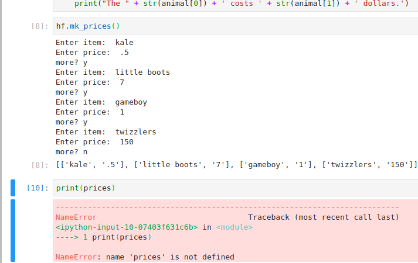
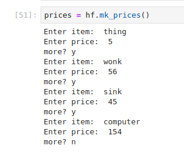
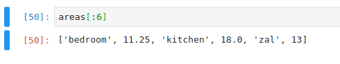

# B''H

## Questions for Sruli

---

### This was happening:



##### Here's the code

```python
def mk_prices():
    prices = []

    while True:
        item = input('Enter item: ')
        price = input('Enter price: ')
        
        prices.append([item, price])
        
        m = input('more?')
        if m == 'n':
            break
    return prices
```

`prices` ceases to exist after I run `hf.mk_prices()`

##### Turns out I had to do this:



---

### Sometimes it returns lists as if I used `print()`



Doesn't seem right. Before I ran it that time, it was returning the list vertically as I would expect.

---

### Trying to understand how the brackets work with tables

Seems like it looks up the records that correspond with what's in the brackets. How is it doing that?

```python
np_positions = df_fifa[' position'].values
np_heights   = df_fifa[' height'].values

# -- -----------------------------------------------------

# Heights of the goalkeepers: 
gk_heights    = np_heights[np_positions == ' GK']

# Heights of the other players: 
other_heights = np_heights[np_positions != ' GK']

# -- -----------------------------------------------------

print("Median height of goalkeepers   : ", str(np.median(gk_heights)))

print("Median height of other players : ", str(np.median(other_heights)))
```

---

### I don't have any idea what to do with the data sets in jupyter

All I know is head and tail. I think you showed me something else, too.

---

### Should I get the 'Python' extension for VSC?

---

### I'd like to make a Hebrew calendar app

For birthdays and yahrtzeits. It would accept dates and make events where the Hebrew date falls on google calendar.